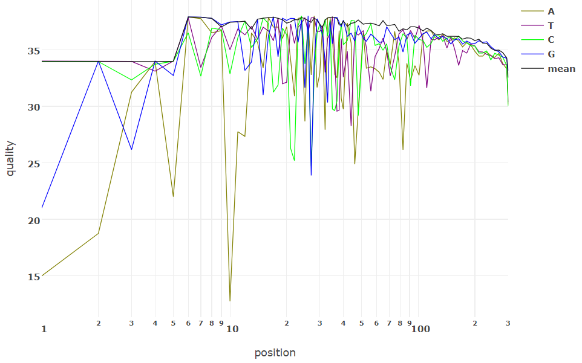
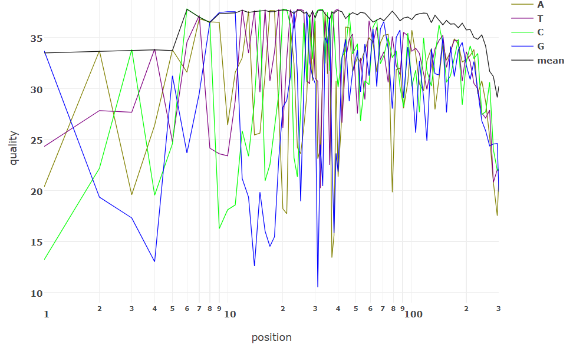
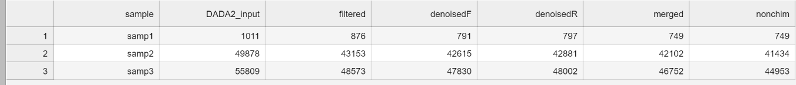
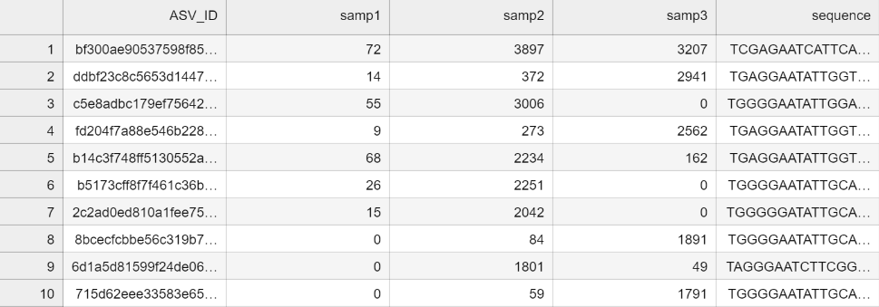

# BIOF501A Project: Taxonomic Classification of the Microbiome in Surviving Colorectal Cancer Patients using the DADA2 Pipeline

#### By: Michael Yoon

#### Disclaimer
Sequence files were obtained from the NCBI SRA archive as part of the study "The local tumor microbiome is associated with survival in late-stage colorectal cancer patients" [1]. Experimental samples chosen were obtained from late-stage (III & IV) colorectal cancer patients. Metadata for patient info can be found here: https://www.ncbi.nlm.nih.gov/Traces/study/?acc=ERP142569&o=acc_s%3Aa or a simplified version is avaible for download in the references folder.

Primers used in this workflow were derived from the study and are as followed:

Forward: CCTACGGGNGGCWGCAG

Reverse: GGACTACHVGGGTATCTAAT

# Introduction:
In 2018, colorectal cancer was reported as one of the most common types of diagnosed cancers ranking 3rd in incidence and 2nd in mortality world wide [2]. Colorectal cancer can cause an array of negative symptoms including fatigue, blood in stool, and abdominal pain which can all negatively impact a patient's quality of life [3]. Generally, the disease is diagnosed by a colonoscopy exam to determine the location of the tumour, however, the technique is known to be fairly invasive and other methods of detection can be beneficial for compliance. In recent times, research has shown how the gut microbiome is associated with colorectal cancer development where certain bacterial strains were identified to be procarcinogenic through the conversion of diestary metabolites into harmful microbial products [4]. Based on this relationship between gut microbiome metabolism and colorectal cancer, there is potential for certain strains to act as biomarkers for the disease. In particular, strains including: _Prevotella, Porphyromonas, Peptostreptococcus, Fusobacterium nucleatum, Parvimonas, Bacteroides fragilis, Streptococcus gallolyticus, Enterococcus faecalis_ and _Escherichia coli_ to name a few [4][5]. For these reasons, investigating the presence and abundance of these strains are relevant in determining colorectal cancer development.

# Workflow overview:

The objective of this project was to create a workflow that would take paired-end sequence files to process through the DADA2 pipeline as part of nf-core/Ampliseq. Resulting output files should include sequence quality and dada2 output files showing the number of species assigned to each sample categorized by ASV ID. Further analysis can be conducted on R to generate relative abundance plots.

https://nf-co.re/ampliseq

The main steps of the workflow include:
1) Unzipping the fastq.gz files
2) Splitting the fastq files into respective forward (R1) and reverse (R2) reads
3) Performing fastp to check for quality and determine a trimming length
4) Zipping the fastq.gz files
5) Running the DADA2 pipeline with parameters obtained from the fastp summary

# Setting up the environment

Deactivate current environment
```sh
conda deactivate
```

Download this repository
```sh
git clone https://github.com/michaelhojungyoon/BIOF501A_Project.git
```

Add on the following directories:
```sh
mkdir results
mkdir sequences/sequences_split
mkdir nf-core results
```

Create conda environment (processing) using the myenv.environment.yml file
```sh
conda create -f myenv_environment.yml
```

Open the nf-core environment and download ampliseq (v2.4.1) -> singularity -> none
```sh
conda activate nf-core
nf-core list
nf-core download ampliseq
conda deactivate
```

Create conda enviroment (nf-core) using nf-core_environemnt.yml file
```sh
conda create -f nf-core_environment.yml
```

# Running the workflow:
Ensure sequence files are located in sequences folder. Afterwards, ensure that you are in the work directory with the workflow.nf file. Output files should be located in sequences/sequences_split labeled <sequence>.noext.fastq.gz
```sh
conda activate myenv
nextflow run workflow.nf -c nextflow.config
```

Deactivate the environment
```sh
conda deactivate
```

Switch to the nf-core enviroment and run the following command. The pipeline will take approximately 10-20 minutes.
Note: --max_memory limit can be removed if memory is not an issue.
```sh
conda activate nf-core
nextflow run nf-core/ampliseq --input "references/samplesheet.tsv" --FW_primer "CCTACGGGNGGCWGCAG" --RV_primer "GGACTACHVGGGTATCTAAT" --trunclenf 280 --trunclenr 240 --outdir "nf-core results" -profile singularity --max_memory '110.GB' 
```

# Expected results
In results folder, output fastp files for quality checking are stored as html files and should look similar to the following:

Read 1:


Read 2:


In nf-core results/dada2, there will be a DADA2_stats.tsv file to show filtered reads and a DADA2_table.tsv file to show ASV IDs associated with each sample.

DADA2_stats.tsv:


DADA2_table.tsv:


In addition to these output files, there are other files showing error logs, qiime2 results, multiqc results, and more.

# Troubleshooting
1) Running workflow.nf appears to stop after completion of each step. May have to run the workflow multiple times to complete each of the steps.
2) If nf-core ampliseq command gives the following warning message: "At least one input file for the following sample(s) was too small (<1KB)". Alternatively, removing all generated files and re-running the workflow to remake the files may resolve the issue.
 
Files that need to be deleted before re-running:
```sh
cd sequences
rm *noext
cd sequences/sequences_split
rm *
cd results
rm *
```

Then --ignore_empty_input_files can be added to the command to ignore input files that are too small.

# References:
1. Debelius, J. W. et al. The local tumor microbiome is associated with survival in late-stage colorectal cancer patients. 2022.09.16.22279353 Preprint at https://doi.org/10.1101/2022.09.16.22279353 (2022).
2. Bray, F. et al. Global cancer statistics 2018: GLOBOCAN estimates of incidence and mortality worldwide for 36 cancers in 185 countries. CA. Cancer J. Clin. 68, 394–424 (2018).
3. Kuipers, E. J. et al. COLORECTAL CANCER. Nat. Rev. Dis. Primer 1, 15065 (2015).
4. Rebersek, M. Gut microbiome and its role in colorectal cancer. BMC Cancer 21, 1325 (2021).
5. Veziant, J., Villéger, R., Barnich, N. & Bonnet, M. Gut Microbiota as Potential Biomarker and/or Therapeutic Target to Improve the Management of Cancer: Focus on Colibactin-Producing Escherichia coli in Colorectal Cancer. Cancers 13, 2215 (2021).
